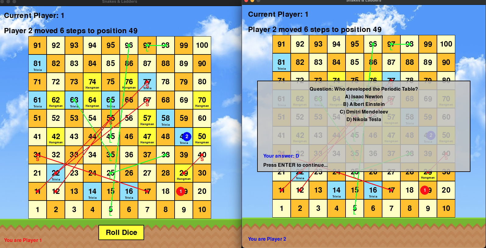
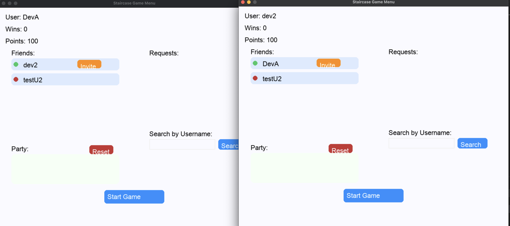

# StairCase — Multiplayer AI-Enhanced Board Game

StairCase is a modern, multiplayer digital remake of the classic Persian game Snakes and Ladders, reimagined for PC and Mac. Designed with nostalgic gameplay and AI-driven enhancements, this project integrates advanced full-stack development, real-time multiplayer functionality, and interactive mini-games powered by language models.

## Gameplay Experience
Players take turns rolling a die to advance across a 10x10 game board. The game introduces interactive obstacles such as:

Snakes and Ladders – moving players forward or backward

Trivia – LLM-generated questions boost or penalize player progress

Hangman – AI-curated word games with dynamic hints

These challenges keep gameplay engaging while allowing two users to compete from separate devices with real-time updates and animations.

## LangChain-Powered Mini-Games
One of the core innovations is the use of LangChain agents to dynamically generate trivia and hangman questions. This allowed us to avoid hardcoding questions and instead rely on natural language generation using Mistral AI. Each mini-game interaction is context-aware, personalized, and processed through Flask API endpoints, providing variety and depth to every playthrough.

## Architecture & Technology
StairCase uses a three-tier architecture:

Front-End Game Client (Pygame): Handles the GUI, player animations, grid system, and local gameplay logic.

Back-End Server (Flask): Manages game state, multiplayer session handling, and communication with Firebase.

Database (Firebase + Firestore): Authenticates users, stores friend lists, game invitations, match history, and user stats.

We modularized the backend using Flask Blueprints to separate authentication/social logic (Menu BP) from gameplay state management (StartGame BP). Each action—from rolling the dice to submitting a mini-game answer—is an API call routed through these endpoints.

## Deployment & Distribution
Frontend Web App: Built in ReactJS and deployed on Vercel to allow user registration and game download access.

Game Backend: Dockerized Flask application hosted via NorthFlank, auto-synced from DockerHub for easy CI/CD.

Cross-Platform Client Builds: Packaged for Windows and Apple M-series devices.

## Social & Multiplayer Features
Users can:

Register securely through Firebase Authentication

Add friends and track online/offline status in real time

Invite others to a game session and sync party lists across clients

Track wins, stats, and user information in Firestore documents

## Testing & Validation
Game logic was rigorously tested using:

Custom Python unittests for board positioning

LangChain prompt debugging in Jupyter notebooks

Local multiplayer emulation with two terminal clients before deployment

